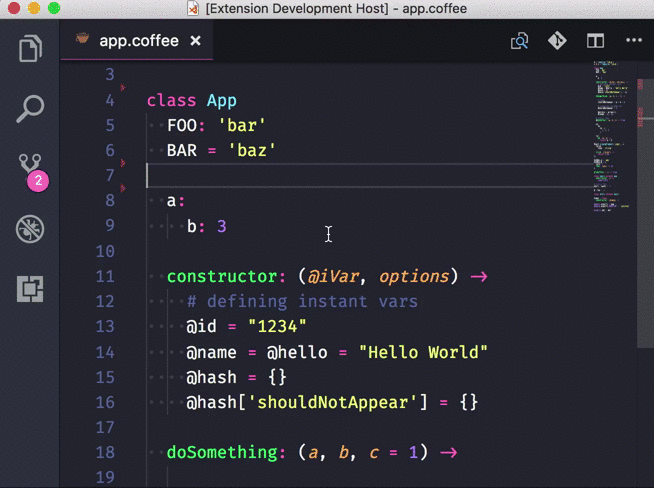

# CoffeeScript Support for Visual Studio Code

A VSCode extension that helps you programming in CoffeeScript.

## Demo

## Features

### Supported

- [x] Syntax check on save
- [x] Show all Symbol Definitions Within a Document ("Go to symbol in file" command)

### Planned

- [ ] Show completion proposals
- [ ] Show all All Symbol Definitions in Workspace ("Go to symbol in workspace" command)
- [ ] Show definition of a symbol
- [ ] Help with function signatures

Low priority

- [ ] Highlight All Occurrences of a Symbol in a Document
- [ ] Show hover box of a symbol

Note: features are described on [Visual Studio Code Language Extension Guidelines](https://code.visualstudio.com/docs/extensionAPI/language-support) page.

## How to Debug

* `npm install` to initialize the extension and the server
* Open this folder in VS Code. In the Debug viewlet, run 'Launch Client' from drop-down to launch the extension and attach to the extension.
* Open `demo/app.coffee`
* Use commands, for example, "Go to symbol in file..." command.
